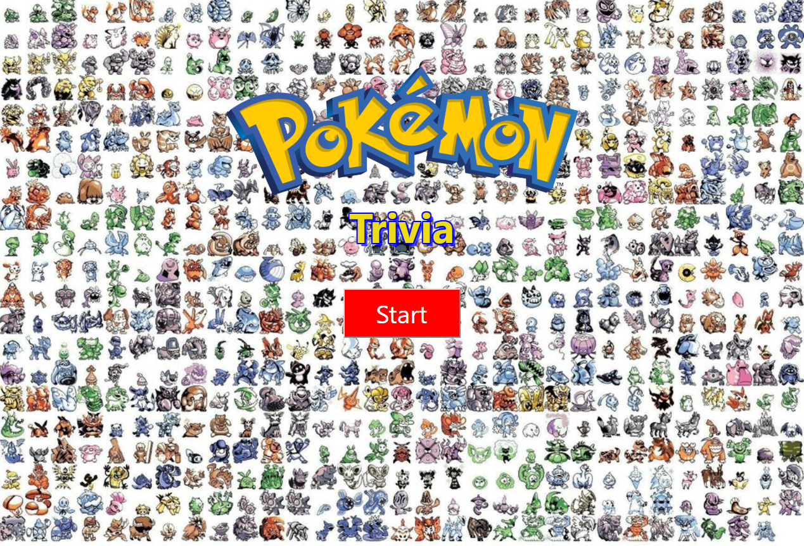

# Pokemon Trivia Game

## Overview

The objective of this assignment was to create a multiple choice question game with a timer.

After initializing on the first screen, the user has 10 seconds to choose between 1 of 4 options.

Choosing the wrong option will result it an "Incorrect" screen while choosing the right option will 
result in a "correct" screen and add 1 point to the user's total score.

After each question is clicked on, whether correct or not, they will proceed to the following question
with another timer of 10 seconds to answer.

After all 10 questions are completed, the user will see a screen with their final score of 
questions answered correctly and incorrectly.

---

## Technologies Used
* HTML
* CSS
* Bootstrap
* jQuery
* Javascript

---

## File Structure

-Root
* index.html
* assets
    * css
        * style.css
    * javascript
        * script.js
    * images

---

## Deployed Link:

[Pokemon Trivia Game](https://bwilson1990.github.io/TriviaGame/)

---

## Screenshot

